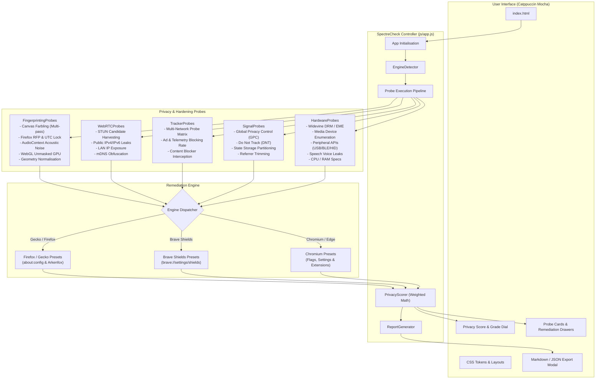
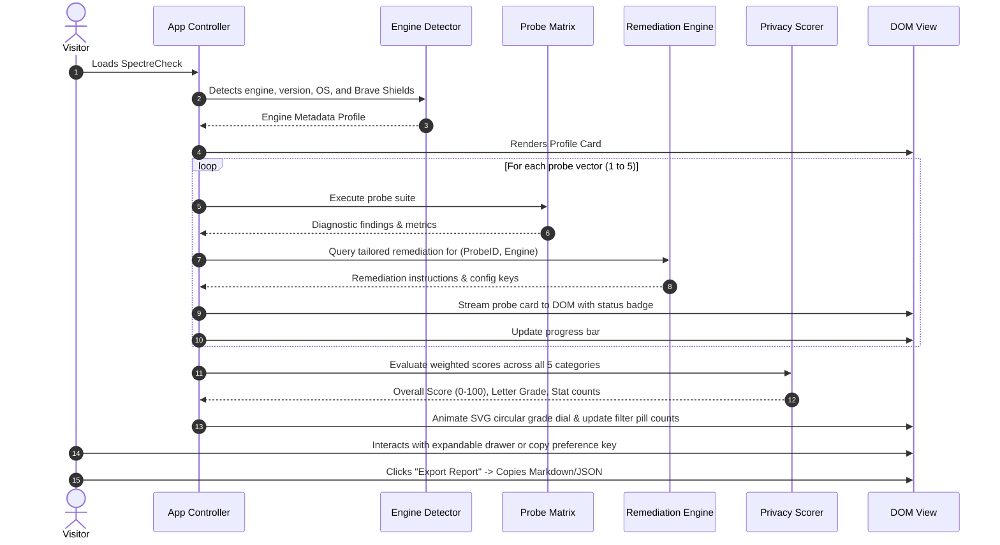

# SpectreCheck Architecture & Methodology

SpectreCheck is a zero-telemetry, client-side browser privacy and hardening auditor engineered to evaluate tracking protection, anti-fingerprinting resistance, WebRTC candidate leaks, and peripheral hardware attack surfaces.

---

## System Architecture

---

## Audit Execution Flow

---

## Probe Vectors & Threat Models

### 1. Anti-Fingerprinting & Farbling Heuristics
* **Canvas Farbling (Multi-Pass)**: Renders 2D canvas with complex Bezier curves, text, and gradients in two sequential passes. Non-deterministic data URLs confirm dynamic noise injection (Brave Shields / CanvasBlocker). Deterministic output flags unmitigated hardware signature extraction.
* **Firefox Resist Fingerprinting (RFP)**: Probes UTC timezone locking (`getTimezoneOffset() === 0`), timer precision clamping (`performance.now()`), and dimension letterboxing.
* **AudioContext**: Evaluates acoustic buffer rendering through DynamicsCompressor and Oscillator nodes to detect audio noise spoofing vs raw DSP hardware variance.
* **WebGL GPU Info**: Queries `WEBGL_debug_renderer_info` to identify unmasked physical GPU model strings.

### 2. WebRTC STUN Harvesting & IP Leaks
* Instantiates `RTCPeerConnection` with public STUN servers (`stun.l.google.com`, `stun.cloudflare.com`).
* Inspects gathered ICE candidates for:
  - **Public IPv4/IPv6 Leaks**: Bypasses VPN/proxy tunnels.
  - **Private LAN IPs**: Internal network topology reconnaissance (`192.168.x.x`, `10.x.x.x`).
  - **mDNS Hostnames**: Verifies `.local` candidate masking.

### 3. Telemetry & Tracker Blocking Matrix
* Dispatches asynchronous `fetch` requests with short timeouts against known ad/telemetry endpoints (Google Analytics, Meta Pixel, DoubleClick, TikTok, Yandex, Clarity, Criteo).
* Categorises connection termination: Network interception / blocker rejection (`PASS`) vs Successful network retrieval (`FAIL`).

### 4. Privacy Signals & Storage Isolation
* Inspects `navigator.globalPrivacyControl` (GPC) and `navigator.doNotTrack` (DNT).
* Evaluates cross-site cookie partitioning and Storage Access API availability.
* Validates strict cross-origin referrer policy trimming.

### 5. Hardware & Peripheral Attack Surfaces
* Probes Encrypted Media Extensions (`navigator.requestMediaKeySystemAccess`) for Widevine DRM tracking keys.
* Queries MediaDevices enumeration for hardware model label leaks without permissions.
* Audits dangerous peripheral APIs: Web Bluetooth, WebUSB, WebHID, Web Serial, and Battery Status API.
* Checks CPU concurrency (`navigator.hardwareConcurrency`) and Speech Synthesis voice enumeration.

---

## Scoring Methodology

The overall privacy score is calculated via weighted category evaluation:

$$\text{Overall Score} = \sum_{c \in C} \left( \frac{\text{Sum of scores in } c}{\text{Count of probes in } c} \times W_c \right)$$

| Category | Weight ($W_c$) | Rationale |
| :--- | :---: | :--- |
| **Anti-Fingerprinting** | **30%** | Cross-site tracking without cookies; highest persistence threat |
| **WebRTC IP Leaks** | **25%** | De-anonymisation risk bypassing VPN and proxy tunnels |
| **Tracker Blocking Matrix** | **25%** | Direct behavioral surveillance by commercial data brokers |
| **Privacy Signals & Storage** | **10%** | Legal rights assertion (GPC) and cross-site cookie isolation |
| **Hardware & Sensor APIs** | **10%** | Attack surface reduction for peripheral and DRM hardware |

### Grading Scale
* **A+ (93 - 100%)**: Maximum hardened configuration (e.g. Tor Browser, Hardened Firefox RFP, Brave Strict).
* **A (82 - 92%)**: Strong privacy posture with active tracker and fingerprint defence.
* **B (70 - 81%)**: Moderate protection; some peripheral or canvas vectors exposed.
* **C (55 - 69%)**: Standard default browser; multiple surveillance vectors active.
* **D (40 - 54%)**: High fingerprinting and tracking exposure.
* **F (< 40%)**: Critical exposure; raw hardware signatures and IP leaks present.
